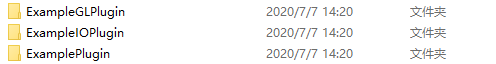
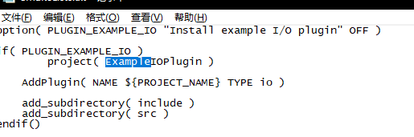
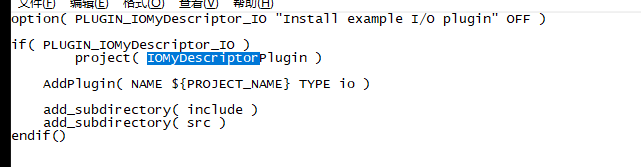
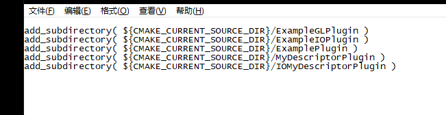

# CloudCompare 插件编写策略

## 一、插件编写准备

### 1.源代码文件内 CloudCompare\plugins\example 下 具有三个文件夹

**ExampleGLPlugin** GL插件

**ExampleIOPlugin**  I/O 插件

**ExamplePlugin**  标准插件

本次以I/O插件为例

复制 **ExampleIOPlugin**   文件夹内所有内容 改名为 **IOMyDescriptorPlugin**

修改内部**所有文件中的** **“Example”为“ IOMyDescriptor”** 注意！ 全都需要修改

并在 example 文件夹内 CMakeList.txt 内添加复制文件夹的路径

### 2.cmake**编译**，在Plugin选项中选择 新建插件名字 的编译选项，用以添加插件工程  

### 3，generate build文件  打开工程，寻找到 IOMyDescriptorPlugin 解决方案进行修改

## 二、代码编写部分

### 1、数据点存储格式

   **CCVector3** P(static_cast<PointCoordinateType>(x), static_cast<PointCoordinateType>(y), static_cast<PointCoordinateType>(z));

### 2、点云数据存储类

 **ccPointCloud*** cloud = new ccPointCloud();

 cloud->addPoint(P);

### 3、数据显示类

 **ccHObject**  container.addChild(cloud);

### 4、输出文字类

****ccLog::Print**(**QStringLiteral("[Camera Params] The file has succeed input"));

### 5、加载文件类

**loadFile**(const QString &fileName, ccHObject &container, LoadParameters &parameters)

## 三、点云显示插件调试

1.IOMyDescriptorPlugin  文件放入  D:\CloudCompare\build\plugins\example  文件内部
2.插件代码/IOMyDescriptorPlugin  将该文件夹内部文件， 放入D:\CloudCompare\CloudCompare\plugins\example\IOMyDescriptorPlugin内 替换
3.即可进行编译运行